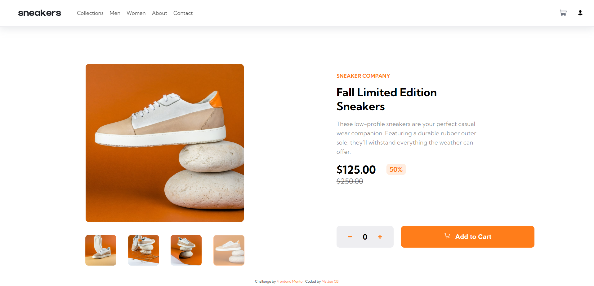

# Sneakers E-commerce - Exemple de Page Responsive

## Description

Cet exemple de page de sneakers de site e-commerce responsive met en avant l'utilisation de Sass, React, Redux Toolkit et des concepts dynamiques pour tester mes compétences en développement web. Il vise à créer une interface utilisateur interactive et réactive pour présenter des sneakers et permettre aux utilisateurs de les explorer. Voici comment vous pouvez utiliser cet exemple :

## Fonctionnalités

- Affichage des sneakers : L'exemple affiche une liste de sneakers avec leurs images, noms, prix et autres détails. Les données sont gérées par Redux Toolkit et peuvent être modifiées dynamiquement.

- Ajout au panier : Les utilisateurs peuvent ajouter des sneakers à leur panier et gérer les quantités.

## Guide d'utilisation

1. Clonez le dépôt du projet depuis GitHub : `git clone https://github.com/Matteo-CB/ecommerce.git`

2. Accédez au répertoire du projet : `cd ecommerce`

3. Installez les dépendances requises en exécutant la commande suivante : `npm install`

4. Lancez l'application en exécutant la commande : `npm start`

5. Ouvrez votre navigateur et accédez à l'URL suivante : `http://localhost:3000`

Vous devriez maintenant voir l'exemple de page de sneakers de site e-commerce responsive dans votre navigateur.

## Limitations

Veuillez noter les limitations suivantes de cet exemple :

- Cet exemple est destiné à tester vos compétences en développement web et ne représente pas un site e-commerce complet.

- Certaines fonctionnalités avancées peuvent ne pas être implémentées dans cet exemple, comme le processus de paiement.

